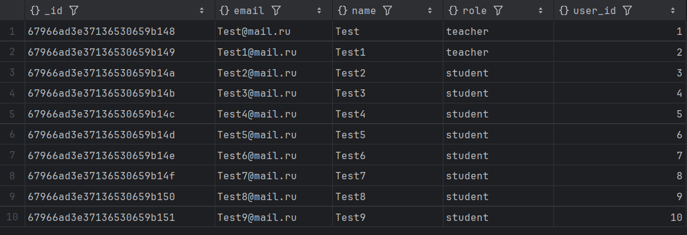
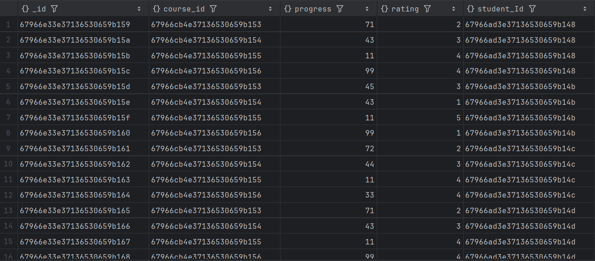
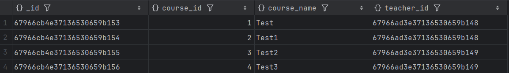
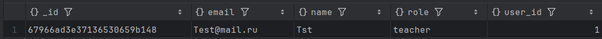
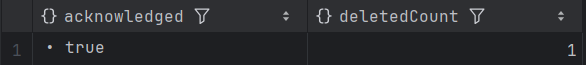
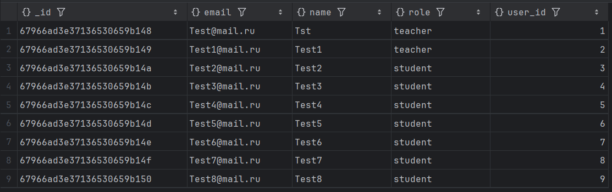
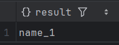
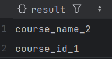
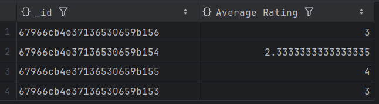
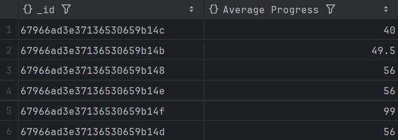

# Домашняя работа №7-8

## Задания:
- Установите MongoDB локально или используйте облачный сервис.
- Выберете тему для БД (маркет-плейс, интернет витрина, LMS...)
- Создайте коллекции для хранения информации по выбранной теме. (минимум 3-4 коллекции)
- Наполните данными коллекции
- Напишите несколько запросов для поиска, обновления и удаления данных в коллекциях.
- Создайте агрегатные запросы для LMS, которые показывают рейтинг курсов и прогресс студентов.
- Настройте индексы для коллекций students и courses
- Если возможно, настройте репликацию MongoDB в локальной среде.

## Решение:
Для выполнения домашних заданий по курсу БД была установлена СУБД MongoDB.

Установка и настройка MongoDB происходит через Docker.

Для запуска системы необходимо ввести команду:

```bash
    docker-compose up -d
```

### Создаем коллекций:

```
    use db;
    db.createCollection("Users");
    db.createCollection("Courses");
    db.createCollection("Course_Students");
```

### Заполняем данные

```
    db.Users.insertMany([{
        user_id: 1,
        name: "Test",
        role: "teacher",
        email: "Test@mail.ru"
    },
    {
        user_id: 2,
        name: "Test1",
        role: "teacher",
        email: "Test1@mail.ru"
    },
    {
        user_id: 3,
        name: "Test2",
        role: "student",
        email: "Test2@mail.ru"
    },
    {
        user_id: 4,
        name: "Test3",
        role: "student",
        email: "Test3@mail.ru"
    },
    {
        user_id: 5,
        name: "Test4",
        role: "student",
        email: "Test4@mail.ru"
    },
    {
        user_id: 6,
        name: "Test5",
        role: "student",
        email: "Test5@mail.ru"
    }
    ,{
        user_id: 7,
        name: "Test6",
        role: "student",
        email: "Test6@mail.ru"
    },
    {
        user_id: 8,
        name: "Test7",
        role: "student",
        email: "Test7@mail.ru"
    },
    {
        user_id: 9,
        name: "Test8",
        role: "student",
        email: "Test8@mail.ru"
    },
    {
        user_id: 10,
        name: "Test9",
        role: "student",
        email: "Test9@mail.ru"
    }]);
    
    
    db.Courses.insertMany([{
        course_id: 1,
        course_name: "Test",
        teacher_id: ObjectId("67966ad3e37136530659b148"),
    },
    {
        course_id: 2,
        course_name: "Test1",
        teacher_id: ObjectId("67966ad3e37136530659b148"),
    },
    {
        course_id: 3,
        course_name: "Test2",
        teacher_id: ObjectId("67966ad3e37136530659b149"),
    },
    {
        course_id: 4,
        course_name: "Test3",
        teacher_id: ObjectId("67966ad3e37136530659b149"),
    }]);
    
    
    db.Course_Students.insertMany([{
        course_id: ObjectId("67966cb4e37136530659b153"),
        student_Id: ObjectId("67966ad3e37136530659b148"),
        progress: 71,
        rating: 2
    },
    {
        course_id: ObjectId("67966cb4e37136530659b154"),
        student_Id: ObjectId("67966ad3e37136530659b148"),
        progress: 43,
        rating: 3
    },
    {
        course_id: ObjectId("67966cb4e37136530659b155"),
        student_Id: ObjectId("67966ad3e37136530659b148"),
        progress: 11,
        rating: 4
    },
    {
        course_id: ObjectId("67966cb4e37136530659b156"),
        student_Id: ObjectId("67966ad3e37136530659b148"),
        progress: 99,
        rating: 4
    },
    {
        course_id: ObjectId("67966cb4e37136530659b153"),
        student_Id: ObjectId("67966ad3e37136530659b14b"),
        progress: 45,
        rating: 3
    },
    {
        course_id: ObjectId("67966cb4e37136530659b154"),
        student_Id: ObjectId("67966ad3e37136530659b14b"),
        progress: 43,
        rating: 1
    },
    {
        course_id: ObjectId("67966cb4e37136530659b155"),
        student_Id: ObjectId("67966ad3e37136530659b14b"),
        progress: 11,
        rating: 5
    },
    {
        course_id: ObjectId("67966cb4e37136530659b156"),
        student_Id: ObjectId("67966ad3e37136530659b14b"),
        progress: 99,
        rating: 1
    },
    {
        course_id: ObjectId("67966cb4e37136530659b153"),
        student_Id: ObjectId("67966ad3e37136530659b14c"),
        progress: 72,
        rating: 2
    },
    {
        course_id: ObjectId("67966cb4e37136530659b154"),
        student_Id: ObjectId("67966ad3e37136530659b14c"),
        progress: 44,
        rating: 3
    },
    {
        course_id: ObjectId("67966cb4e37136530659b155"),
        student_Id: ObjectId("67966ad3e37136530659b14c"),
        progress: 11,
        rating: 4
    },
    {
        course_id: ObjectId("67966cb4e37136530659b156"),
        student_Id: ObjectId("67966ad3e37136530659b14c"),
        progress: 33,
        rating: 4
    },
    {
        course_id: ObjectId("67966cb4e37136530659b153"),
        student_Id: ObjectId("67966ad3e37136530659b14d"),
        progress: 71,
        rating: 2
    },
    {
        course_id: ObjectId("67966cb4e37136530659b154"),
        student_Id: ObjectId("67966ad3e37136530659b14d"),
        progress: 43,
        rating: 3
    },
    {
        course_id: ObjectId("67966cb4e37136530659b155"),
        student_Id: ObjectId("67966ad3e37136530659b14d"),
        progress: 11,
        rating: 4
    },
    {
        course_id: ObjectId("67966cb4e37136530659b156"),
        student_Id: ObjectId("67966ad3e37136530659b14d"),
        progress: 99,
        rating: 4
    },
    {
        course_id: ObjectId("67966cb4e37136530659b153"),
        student_Id: ObjectId("67966ad3e37136530659b14e"),
        progress: 71,
        rating: 5
    },
    {
        course_id: ObjectId("67966cb4e37136530659b154"),
        student_Id: ObjectId("67966ad3e37136530659b14e"),
        progress: 43,
        rating: 1
    },
    {
        course_id: ObjectId("67966cb4e37136530659b155"),
        student_Id: ObjectId("67966ad3e37136530659b14e"),
        progress: 11,
        rating: 2
    },
    {
        course_id: ObjectId("67966cb4e37136530659b156"),
        student_Id: ObjectId("67966ad3e37136530659b14e"),
        progress: 99,
        rating: 4
    },
    {
        course_id: ObjectId("67966cb4e37136530659b153"),
        student_Id: ObjectId("67966ad3e37136530659b14f"),
        progress: 99,
        rating: 4
    },
    {
        course_id: ObjectId("67966cb4e37136530659b154"),
        student_Id: ObjectId("67966ad3e37136530659b14f"),
        progress: 99,
        rating: 3
    },
    {
        course_id: ObjectId("67966cb4e37136530659b155"),
        student_Id: ObjectId("67966ad3e37136530659b14f"),
        progress: 99,
        rating: 5
    },
    {
        course_id: ObjectId("67966cb4e37136530659b156"),
        student_Id: ObjectId("67966ad3e37136530659b14f"),
        progress: 99,
        rating: 1
    },
    ]);
```

### Просмотр заполненных данных

```
    db.Users.find().pretty()
    db.Course_Students.find().pretty()
    db.Courses.find().pretty()
```
#### Коллекция Users


#### Коллекция Course_Students


#### Коллекция Courses


### Обновление данных в коллекции Users
```
    db.Users.updateOne({email:"Test@mail.ru"}, {$set:{name: "Tst"}});
```
#### Результат


### Удаление данных из коллекции Users

```
    db.Users.deleteOne({email:"Test9@mail.ru"});
```

#### Результат






### Создание индексов в коллекциях Courses и Users

#### Users
```
    db.Users.createIndex(
    {"name" :1}
    )
    
    db.Users.createIndex(
    {"user_id" :1}
    )
```

#### Результат


#### Courses
```
    db.Courses.createIndexes([
        {"course_name" : 2},
        {"course_id" : 1}
    ]);
```

#### Результат


### Функции агрегации

### Рейтинг курса
```
    db.Course_Students.aggregate([{$group : {_id :"$course_id", "Average Rating" : {$avg : "$rating"}}}])
```
#### Результат


### Прогресс студентов
```
    db.Course_Students.aggregate([{$group : {_id :"$student_Id", "Average Progress" : {$avg : "$progress"}}}])
```
#### Результат


### Установить репликацию локально не получилось