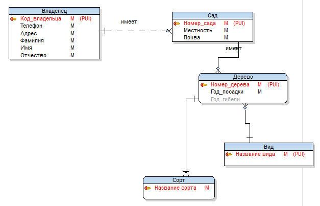
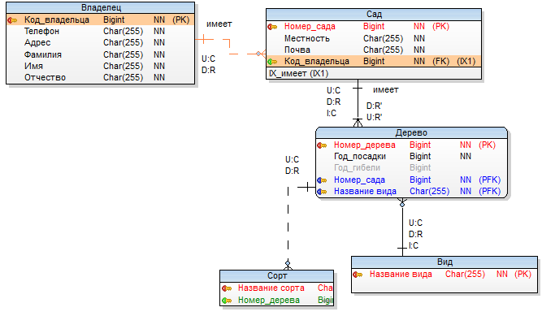

# Домашняя работа №2
Выполнено на основе домашнего задания №1 (**скрипт создания БД**)
## Задания:
- Создайте свою собственную базу данных для гипотетического проекта (например, система управления библиотекой).
- Опишите таблицы и связи между ними.
- Реализуйте базовые SQL-запросы для работы с этими данными: создание таблиц, вставка, выборка, обновление и удаление данных.

## Решение:
Для выполнения домашних заданий по курсу БД была установлена СУБД PostgreSQL. Также для дальнейшего взаимодействия с базой данных было установлено приложение для взаимодействия с Базой данных - PGAdmin.

Установка и настройка PostgreSQL и PGAdmin происходит через Docker.

Для запуска системы необходимо ввести команду:

```bash
    docker-compose up -d
```

Для домашнего задания была выбрана информационная система учета высадки садовых посадок.

### Краткое описание выбранной информационной системы:
- Владелец имеет несколько участков, именуемых далее Садами. 
- Сад характеризуется наименованием местности, а также кратким описанием почвы. 
- В саду растут фруктовые деревья различных видов (персики, сливы, яблони и т.д.). 
- Каждый вид имеет сорта (груша - бергамот, яблоня – антоновка и т.д.). 
- Поскольку дерево можно прививать, то на одном дереве может быть несколько сортов плода данного вида (т.е. дерево относится к одному виду, но может нести несколько сортов). 
- Существует множество деревьев каждого вида и сорта. Наконец, каждый сорт относится только к одному виду, тогда как каждый вид имеет несколько сортов. 
- Каждое дерево характеризуется также годом посадки и годом гибели (если дерево живое, то этот атрибут пуст).

### Информационно-логическая модель данных


### Модель данных


### Описание связей базы данных:
#### «Владелец» и «Сад». 
Вставка строк в таблицу «Владелец» всегда разрешена (стандартное правило поддержки ссылочной целостности), поскольку могут существовать владельцы, которые еще не приобрели сад. 
- Удаление из таблицы «Владелец» ограничено (**Restrict**), если за владельцем числится какой-то сад, то запись о владельце удалять нельзя, поскольку каждый сад должен принадлежать какому-то владельцу (стандартное правило поддержки ссылочной целостности). 
- Когда меняется код владельца в таблице «Владелец», нужно распространить это изменение на одноименный столбец в таблице «Сад», производя каскадное (**Cascade**) обновление. 

Со стороны таблицы «Сад» действуют стандартные правила поддержки ссылочной целостности: 
- удаление сада разрешено; 
- запрещено добавление сада для несуществующего владельца; 
- запрещено обновлять код владельца номером несуществующего владельца.

#### «Сад»
Для таблицы «Сад» действуют следующие правила поддержки ссылочной целостности: 
- **Delete Restrict** (если саду растет какое-либо дерево, то запись об этом саде удалять нельзя – стандартное правило); 
- **Update Cascade** (каскадное обновление номера сада); 
- **Insert Cascade** (при добавлении нового сада нужно для него добавить дерево в таблицу «Дерево»). 

Со стороны таблицы «Дерево» действуют следующие правила поддержки ссылочной целостности: 
- запрещено добавление дерева для не существующего сада (стандартное правило); 
- если удаляемое или обновляемое дерево (обновляется номер дерева) является единственным в саду, то удалять его и обновлять для него номер дерева запрещено (обновление программируется отдельно в СУБД).

#### «Вид»
Для таблицы «Вид» действуют следующие правила поддержки ссылочной целостности: 
- **Delete Restrict** (если растет какое-либо дерево определенного вида, то запись об этом виде удалять нельзя – стандартное правило); 
- **Update Cascade** (каскадное обновление названия вида); 
- **Insert Cascade** (при добавлении нового вида нужно для него добавить дерево в таблицу «Дерево»). Со стороны таблицы «Дерево» действуют следующие правила: удаление дерева разрешено; запрещено добавление дерева для несуществующего вида; запрещено обновлять название вида несуществующим названием.

#### «Дерево»
Для таблицы «Дерево» действуют следующие правила поддержки ссылочной целостности: 
- **Delete Restrict** (если на дереве есть привитый сорт, то запись об этом сорте удалять нельзя – стандартное правило); -
- **Update Cascade** (каскадное обновление номера дерева). 

Со стороны таблицы «Сорт» действуют следующие правила поддержки ссылочной целостности: 
- запрещено добавление сорта для несуществующего дерева; 
- удаление сорта разрешено; 
- запрещено обновлять номер дерева номер несуществующего дерева.
